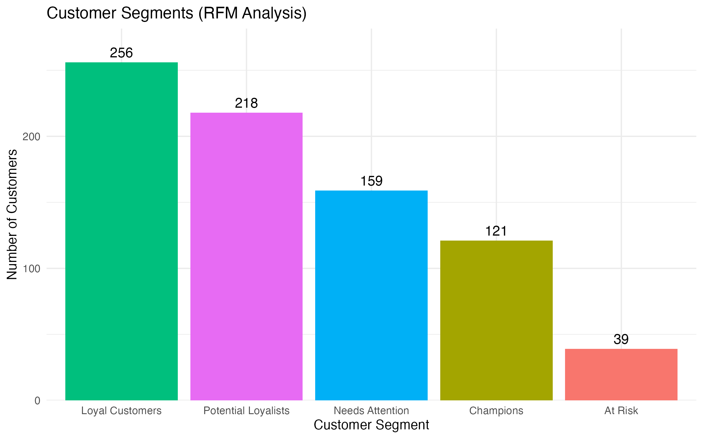

# Superstore RFM Customer Segmentation

This project applies **RFM (Recency, Frequency, Monetary) analysis** to the Superstore sales dataset to segment customers into actionable groups such as **Champions**, **Loyal Customers**, **Potential Loyalists**, **Needs Attention**, and **At Risk**.  
The goal is to help marketing teams identify high-value customers and optimize engagement strategies.

## Key Features
- Clean, reproducible R pipeline for RFM scoring and segmentation  
- Interactive customer table with currency-formatted monetary values  
- Visual summary of segment distribution  
- Business-ready insights for marketing prioritization  

## Outputs
- `rfm_customer_segments.csv`: Full customer list with RFM scores and segments  
- `rfm_segment_summary.csv`: Aggregated metrics per segment  
- `Superstore_RFM_Customer_Segmentation.html`: Interactive HTML report

- ## Visual Summary

The visualization above shows how customers are distributed across RFM segments.  
**Loyal Customers** and **Potential Loyalists** dominate the customer base, indicating strong engagement,  
while **At Risk** customers may require targeted reactivation campaigns.

## Data Source
Dataset used in this project:  
[Superstore Dataset (Kaggle)](https://www.kaggle.com/datasets/vivek468/superstore-dataset-final/data)

> **Disclaimer:**  
> The dataset is owned and originally published by a third party.  
> This project is created **for educational and portfolio purposes only** and does not claim ownership of the data.

> **Next Step:** [Predictive Customer Analytics (Project 2)](https://moneteer808-oss.github.io/Superstore-Predictive-Customer-Analytics/)  
> This follow-up project builds on the segmentation results to predict churn and customer lifetime value (CLV) using machine learning.

---

### 📂 Related Repository
- [Superstore Predictive Customer Analytics (Project 2)](https://github.com/moneteer808-oss/Superstore-Predictive-Customer-Analytics)

